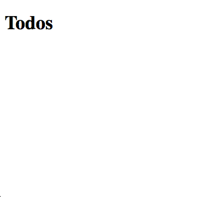
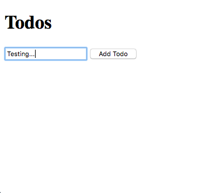
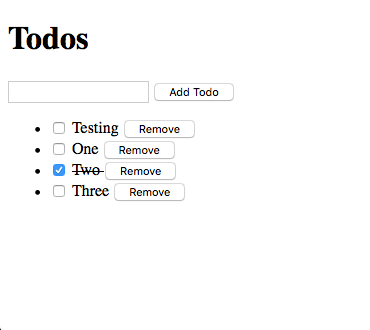

## Setup

Aurelia is an amazing framework that embraces simple and clean code without sacrificing power. In this tutorial we'll introduce you to the simplicity of Aurelia through the construction of a "Todo" application. You'll see just how clean and simple your application code can be and you'll learn several of the basic concepts and capabilities of Aurelia.

For this tutorial, we're going to use the Aurelia CLI. If you've already setup your machine with the CLI, you can skip to the next section. If not, then please install the following CLI prerequisites:

* Install NodeJS version 10 or above.
    * You can [download it here](https://nodejs.org/en/).
* Install a Git Client
    * install [the standard Git client](https://git-scm.com).
    * optionally, install [a nice GUI client](https://desktop.github.com).

> Warning
> When installing Git for Windows, there is an option to `use git bash only`, `run git from windows command prompt`, or `run git and included unix tools from windows command prompt`. You must choose `run git from windows command prompt` or `run git and included unix tools from windows command prompt` in order for the Aurelia CLI to work.

Once you have the prerequisites installed, you can install the Aurelia CLI itself. From the command line, use npm to install the CLI globally:

```Shell
npm install -g aurelia-cli
```

> Info
> Always run commands from a Bash prompt. Depending on your environment, you may need to use `sudo` when executing npm global installs.

## Creating A New Aurelia Project

Now, that you've got your machine setup, we can create our todo app. To create the project, run `au new` from the command line. You will be presented with a number of options. Name the project "todo" and then select either the "Default ESNext" or "Default TypeScript" option depending on what is most comfortable for you. (Do not select "Custom" for this tutorial.)

After that, you'll be asked if you would like to install your new project's dependencies. Press enter to select the default "yes" for this as well.

Once the dependencies are installed (it will take a few minutes), your project is ready to go. Just change directory into the project folder and run it by typing `au run --open`. This will run the app, open a browser tab, and watch the project's source for changes. If you've got everything setup correctly, you should see the message "Hello World!" in the browser.

Now you'll need to configure this documentation to show all code samples in your preferred programming language. If you scroll down a bit and look to the right of any source-code example, you will see a dropdown for selecting your preferred programming language, ESNext or TypeScript. Click that and be sure to select the language that matches your choice.

That's it. Your language selection is now configured with these docs and with your new project.

## The App Class

One of the amazing things you can do with Aurelia, that you can't with any other framework or library, is model your entire application using plain ${context.language.name}. We think you'll understand it when you see it.

We're going to overwrite the `App` class provided by the skeleton.

Our todo application contains a list of todo instances. It can add and remove todos. The todos are added by allowing the user to provide a todo description. Once they type a description and add the todo, the description is cleared so they can create another todo. Let's model these ideas.

```JavaScript src/app.js
export class App {
  constructor() {
    this.heading = 'Todos';
    this.todos = [];
    this.todoDescription = '';
  }

  addTodo() {
    if (this.todoDescription) {
      this.todos.push({
        description: this.todoDescription,
        done: false
      });
      this.todoDescription = '';
    }
  }

  removeTodo(todo) {
    const index = this.todos.indexOf(todo);
    if (index !== -1) {
      this.todos.splice(index, 1);
    }
  }
}
```
```TypeScript src/app.ts [variant]
interface ITodo {
  description: string;
  done: boolean;
}

export class App {
  heading: string;
  todos: ITodo[];
  todoDescription: string;

  constructor() {
    this.heading = 'Todos';
    this.todos = [];
    this.todoDescription = '';
  }

  addTodo(): void {
    if (this.todoDescription) {
      this.todos.push({
        description: this.todoDescription,
        done: false
      });
      this.todoDescription = '';
    }
  }

  removeTodo(todo: ITodo): void {
    const index = this.todos.indexOf(todo);
    if (index !== -1) {
      this.todos.splice(index, 1);
    }
  }
}
```

Again, it's that simple. Let's review the ideas we modeled:

* Our application has a `heading` of "Todos".
* The todo list is modeled as an array of todo instances represented by the `todos` property.
* Todo instances can be added (`addTodo`) or removed (`removeTodo`).
* When a new todo is added, it is given a description, with a done flag default to false.
* After a new todo is added, the todoDescription is cleared to enable the next addition.

Here's what's amazing. This is all the ${context.language.name} code for the app. But where is Aurelia? Well, the answer is that Aurelia tries as hard as possible to stay out of your ${context.language.name} code. That's why you don't see it above. It's not needed. Aurelia has the ability to render plain ${context.language.name} objects.

## Rendering the App

As a brief recap, remember that almost nothing we've done so far is Aurelia-specific. Almost all the code we've written is just vanilla ${context.language.name}. There is `src/main${context.language.fileExtension}` file which is the starting point of your app, it conventionally use `src/app${context.language.fileExtension}` as the root UI component by default. For more information, read [App Configuration and Startup](/docs/fundamentals/app-configuration-and-startup).

In order to render, we need to create a view for the `app` component. This introduces the next convention of Aurelia. To create a view for any class, simply create an HTML file with the same name as the ${context.language.name} module but change the file extension to `.html`. Inside that view, you can place an HTML 5 template with *data binding expressions* declaring how the view should render an instance of the class. Let's start with a very basic view of our `app`, overwrite `src/app.html` provided by the skeleton.

```HTML src/app.html
<template>
  <h1>${heading}</h1>
</template>
```

There are a couple of things to notice here. First, all views are wrapped in a Web Components `template` element. Second, did you notice the `\${heading}` syntax? Well, inside of a view, you have access to all the properties and methods of the class instance associated with that View and you can access them inside the content of any element or attribute by using the ${context.language.name} template string syntax as shown above. The above syntax creates a one-way data-binding to the `heading` property. By "one-way" we mean that the dataflow is unidirectional and only changes to the `heading` property will affect the view. There is no "reverse" flow from the view back to the view-model.

> Info: Presentation Patterns
> We call a View's associated class its *View-Model* because it's a model for, or a model of the View. Most Aurelia development leverages the Model - View - View-Model pattern. However, Aurelia is flexible enough to enable also using patterns like Supervising Controller, Passive View and Model - View - Controller if desired.


Run `au run --open` if you haven't done that. When you run the app, you should see the app render out the `heading` property, something like this:



Rendering properties in HTML seems simple enough, but what about working with user input? Let's add some markup that enables us to take input from the user to create our todos:

```HTML app.html
<template>
  <h1>${heading}</h1>

  <form submit.trigger="addTodo()">
    <input type="text" value.bind="todoDescription">
    <button type="submit" disabled.bind="!todoDescription">Add Todo</button>
  </form>
</template>
```

Now, we've added a `form` to our view. We're using this to collect the todo name from the user. Take a look at the `input`. By appending `.bind` to the `value` attribute, we've told Aurelia that we want it to be bound to the `todoDescription` on our view-model. In Aurelia, you can bind *any* HTML attribute to its view model with a simple property expression like this, just by appending `.bind`.

Here, we have another convention that it's important to point out. When we use `.bind` Aurelia works on your behalf to pick the most sensible "binding mode" based on the element and attribute you are binding. For example, since this is an `input` and you are binding its `value` then `.bind` will cause Aurelia to set up a two-way binding. This means that any time the view-model's `todoDescription` changes, it will be updated in the input's `value` property but also any time the input's `value` property changes, the view-model will have its `todoDescription` updated as well.

The other binding `disabled.bind="!todoDescription"` set `<button>` to disabled when `todoDescription` is empty. It is a one-way binding, as there is no user input to sync back.

There's something else of note in this markup though. We can not only bind properties, but you can attach to events. Take a look at the `form` element itself. In Aurelia, you can take *any* DOM event and append `.trigger` to it. This means that when that event fires, it will trigger the associated expression to be evaluated. In this case, the `submit` event causes the `addTodo()` method to be invoked. Because we've used the `submit` event, it means that the todo will be added either by pressing the submit button or by pressing enter while inside the input.

> Info: Binding Commands
> Aurelia will use two-way binding for all form control value bindings and one-way binding for everything else. However, you can always override this by using an explicit binding command. For example, instead of using `.bind` you can use `.one-way`, `.two-way` or `.one-time`. Similarly, you can use `.delegate` for event delegation in place of `.trigger`.

If you run the app now, you should see something like this:



Try typing into the input box and adding the todo. You should notice that the input box gets cleared out each time you do that. The reason for this is that the `value` of the `input` has two way binding and our original code cleared out the `todoDescription` after adding a new todo instance. Here's our `addTodo()` implementation for reference:

```JavaScript The Add Todo Implementation
addTodo() {
  if (this.todoDescription) {
    this.todos.push({
      description: this.todoDescription,
      done: false
    });
    this.todoDescription = '';
  }
}
```
```TypeScript The Add Todo Implementation [variant]
addTodo() {
  if (this.todoDescription) {
    this.todos.push({
      description: this.todoDescription,
      done: false
    });
    this.todoDescription = '';
  }
}
```

Well, we can now add todos, but we can't see them! Let's remedy that by looking at how Aurelia handles lists of data. Change your markup to match this new version:

```HTML src/app.html
<template>
  <h1>${heading}</h1>

  <form submit.trigger="addTodo()">
    <input type="text" value.bind="todoDescription">
    <button type="submit" disabled.bind="!todoDescription">Add Todo</button>
  </form>

  <ul>
    <li repeat.for="todo of todos">
      <input type="checkbox" checked.bind="todo.done">
      <span>
        ${todo.description}
      </span>
      <button click.trigger="removeTodo(todo)">Remove</button>
    </li>
  </ul>
</template>
```

To generate HTML based on an Array, Map or Set, we use the `repeat.for="local of collection"` syntax. This syntax is derived from the `for...of` loop of ${context.language.name} itself. As you can see above, we want to generate one `li` for each item in our `todos` array. So, we place a `repeat.for` attribute on the `li` we want to be generated and we specify the `todos` collection and that we want the local loop variable to be named `todo`. With this we can bind to any property of the `todo` instance. So, you can see how we're just re-applying all the same techniques from above now. We're binding the `checked` attribute to the todo's `done` property and its `description` property is being injected into the content of the `span`. Finally, we're adding a `trigger` on the button's `click` event so that we can remove the todo. Notice that the `removeTodo` is still in scope. Just like in ${context.language.name}, inside a loop, you still have access to the variable in the outer block. This allows us to call the `removeTodo` method on the App class, passing in the particular todo instance that we want to remove.

If you run the application again, you should now see something like this:


We're almost there! There's one thing that's missing. Notice that if you check and uncheck the boxes, nothing happens. We would like to have some user feedback in this case. Perhaps crossing out the todo item? Let's make one final version of our view to add that in:

```HTML app.html
<template>
  <h1>${heading}</h1>

  <form submit.trigger="addTodo()">
    <input type="text" value.bind="todoDescription">
    <button type="submit" disabled.bind="!todoDescription">Add Todo</button>
  </form>

  <ul>
    <li repeat.for="todo of todos">
      <input type="checkbox" checked.bind="todo.done">
      <span css="text-decoration: ${todo.done ? 'line-through' : 'none'}">
        ${todo.description}
      </span>
      <button click.trigger="removeTodo(todo)">Remove</button>
    </li>
  </ul>
</template>
```

This final example shows how we can bind css directly on any HTML element. It also shows how we can use our `\${}` syntax directly inside any attribute. In this case, we want to add the `text-decoration` of `line-through` whenever the todo's `done` property is true, otherwise we want the `none` value.

> Warning: style vs css attribute
> Use the `style` attribute's alias, `css` when doing string interpolation to ensure your application is compatible with Internet Explorer and Edge, if you care about supporting these browsers.

Run the application one more time and you should see the expected result:



## Conclusion

With its strong focus on developer experience, Aurelia can enable you to not only create amazing applications, but also enjoy the process. We've designed it with simple conventions in mind so you don't need to waste time with tons of configuration or write boilerplate code just to satisfy a stubborn or restrictive framework. You'll never hit a roadblock with Aurelia either. It's been carefully designed to be pluggable and customizable...and most of the time you just write plain ${context.language.name} and forget the framework is even there.

Thanks for taking the time to read through our guide. There's so much more to learn and do! We hope you'll continue on to our [Contact Manager Tutorial](docs/tutorials/creating-a-contact-manager) to learn how to use the Aurelia CLI to get setup with a production-grade project and use some more advanced features like routing, publish/subscribe and custom elements.

We're looking forward to seeing what you create!
