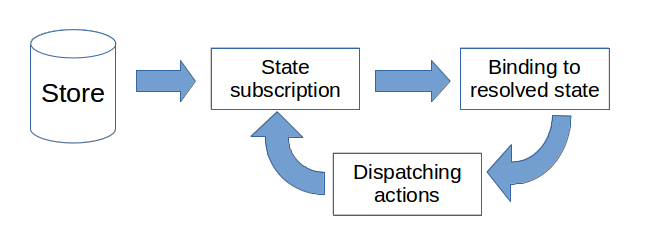

## Introduction

This article covers the Store plugin for Aurelia. It is built on top of two core features of [RxJS](http://reactivex.io/rxjs/), namely Observables and the BehaviorSubject. You don't have to delve into the reactive universe - in fact, you'll barely notice it at the beginning. But you can certainly benefit from having some knowledge about RxJS in order to use it wisely.

Various examples, demonstrating individual pieces of the plugin, can be found in the [samples repository](https://github.com/zewa666/aurelia-store-examples).

### Reasons for state management

A lot of modern development approaches leverage a single store, which acts as a central basis of your app. The idea is that it holds all data that makes up your application. The content of your store is your application's state. If you will, the app state is a snapshot of all data at a specific moment in time. You modify that by using Actions, which are the only way to manipulate the global state, and create the next app state.

Contrast this to classic service-oriented approaches, where data is split amongst several service entities. What turns out to be a simpler approach, in the beginning, especially combined with a powerful IoC Container, can become a problem once the size of the app grows. Not only do you start to get increased complexity and inter-dependency of your services, but keeping track of who modified what and how to notify every component about a change can become tricky.

Leveraging a single store approach, there is only one source of truth for your data and all modifications happen in a predictable way, potentially leading to a *more* side-effect-free overall application.

### Why is RxJS used for this plugin?

As mentioned in the intro this plugin uses RxJS as a foundation. The main idea is having a [BehaviorSubject](http://reactivex.io/rxjs/manual/overview.html#behaviorsubject) `store._state` which will store the current state. It starts with some initial state and emits new states as they come. The BehaviorSubject cannot be accessed directly - it is defined as private - but instead a public Observable named `state` should be consumed. This way consumers only have reading access to streamed values but cannot directly manipulate the streaming queue through the Subjects `next` method.

But besides these core features, RxJS itself can be described as *[Lodash/Underscore for events](http://reactivex.io/rxjs/manual/overview.html#introduction)*. As such all of the operators and objects can be used to manipulate the state in whatever way necessary. As an example [pluck](http://reactivex.io/rxjs/class/es6/Observable.js~Observable.html#instance-method-pluck) can be used to pierce into a sub-section of the state, whereas methods like [skip](http://reactivex.io/rxjs/class/es6/Observable.js~Observable.html#instance-method-skip) and [take](http://reactivex.io/rxjs/class/es6/Observable.js~Observable.html#instance-method-take) are great ways to unit test the stream of states over time.

The main reason for using RxJS though is that observables are delivered over time. This promotes a reactive approach to how you'd design your application. Instead of pursuing an imperative approach like **a click on button A** should **trigger a re-rendering on component B**, we follow an [Observer Pattern](https://en.wikipedia.org/wiki/Observer_pattern) where **component B observes a global state** and **acts on changes**, which are **triggered through actions by button A**.

Broken down to the concepts of Aurelia, as depicted in the following chart, this means that a ViewModel subscribes to the single store and sets up a state subscription. The view directly binds to properties of the state. Actions can be dispatched and trigger the next state emit. Now the initial subscription receives the next state and changes the bound variable, Aurelia automatically figures out what changed and triggers a re-render. The next dispatch will then trigger the next cycle and so on. This way the system behaves in a cyclic, reactive way and sees state changes as requests for a re-rendering.



A fundamental benefit of that approach is that you as a developer do not need to think of signaling individual components about changes, but rather they will all listen and react to changes by themselves if the respective part of the state gets modified. Think of it as an event dispatch, where multiple recipients can listen for and perform changes but with the benefit of a formalized global state. As such, all you need to focus on is the state and the rest will be handled automatically.

Another benefit is the async nature of the subscription. No matter whether the action is a synchronous operation, like changing the title of your page, an Ajax request to fetch the latest products or a long-running web-socket for your next chat application: whenever you dispatch the next action, listeners will react to these changes.

## Getting Started

Install the npm dependency via

```Shell
npm install aurelia-store
```

or using [Yarn](https://yarnpkg.com)

```Shell
yarn add aurelia-store
```

> Info
> If you're not using RxJS at all so far it is recommended to run `npm install rxjs` which should install the latest available rxjs (currently 6.x.x) version as a project dependency.


> Info
> With the recent release of RxJS v.6, which this plugin depends on, quite a lot has changed. There are new ways to import dependencies and ways to keep compatibility with previous API versions. Take a look at the [following upgrade instructions](https://github.com/ReactiveX/rxjs/blob/master/docs_app/content/guide/v6/migration.md) for further details.

## What is the State?

A typical application consists of multiple components, which render various data. Besides actual data though, your components also contain various statuses. An "active" status for a toggle button for example, but also high-level statuses like the selected theme or the current page.
State that is contained within the component is a good thing, as long as only that single component instance cares about it. But the moment you reference that state from another component, you're going to need a way to communicate about that state, like service classes. Pub-sub mechanisms like the EventAggregator are another example of inter-component communication.

In contrast to that, the Store plugin operates on a single overall application state. Think of it as a large object containing all the sub-states reflecting your applications condition at a specific moment in time. This state object needs to only contain serializable properties. With that you gain the benefit of having snapshots of your app, which allow all kinds of cool features like time-traveling, save/reload and so on.

How much you put into your state is up to you, but a good rule of thumb is that as soon as two different areas of your application consume the same data or affect the same component state you should store them.

Your app will typically start with an initial state, which is then manipulated throughout the app's lifecycle. As mentioned this state can be pretty much anything, like shown in the example below. Whether you prefer TypeScript or pure JavaScript is up to you, but having a typed state allows for easier refactoring and better autocompletion support.

```JavaScript Defining the State entity and initialState
// there is no need for a dedicated entity in JavaScript

// state.js
export const initialState = {
  frameworks: ['Aurelia', 'React', 'Angular']
};
```
```TypeScript Defining the State entity and initialState [variant]
// state.ts
export interface State {
  frameworks: string[];
}

export const initialState: State = {
  frameworks: ['Aurelia', 'React', 'Angular']
};
```

## Configuring your app

In order to tell Aurelia how to use the plugin, we need to register it. This is done in your app's `main` file, specifically the `configure` method. We'll have to register the Store using our previously defined State entity:

```JavaScript Registering the plugin
// main.js
import { Aurelia } from 'aurelia-framework';
import { initialState } from './state';

export function configure(aurelia) {
  aurelia.use
    .standardConfiguration()
    .feature('resources');

  ...

  aurelia.use.plugin('aurelia-store', { initialState });  // <----- REGISTER THE PLUGIN

  aurelia.start().then(() => aurelia.setRoot());
}
```
```TypeScript Registering the plugin [variant]
// main.ts
import { Aurelia } from 'aurelia-framework';
import { initialState } from './state';

export function configure(aurelia: Aurelia) {
  aurelia.use
    .standardConfiguration()
    .feature('resources');

  ...

  aurelia.use.plugin('aurelia-store', { initialState });  // <----- REGISTER THE PLUGIN

  aurelia.start().then(() => aurelia.setRoot());
}
```

With this done we're ready to consume our app state and dive into the world of state management.

## Subscribing to the stream of states

As explained in the beginning, the Aurelia Store plugin provides a public observable called `state` which will stream the app's states over time. So in order to consume it, we first need to inject the store via dependency injection into the constructor. Next, inside the `bind` lifecycle method we are subscribing to the store's `state` property. Inside the subscription's *handler* we'll have the actually streamed state and may assign it to the component's local state property. And let's not forget to dispose of the subscription once the component becomes unbound. This happens by calling the subscription's `unsubscribe` method.

```JavaScript Injecting the store and creating a subscription
// app.js
import { inject } from 'aurelia-dependency-injection';
import { Store } from 'aurelia-store';

import { State } from './state';

@inject(Store)
export class App {
  constructor(store) { this.store = store; }

  bind() {
    this.subscription = this.store.state.subscribe(
      (state) => this.state = state
    );
  }

  unbind() {
    this.subscription.unsubscribe();
  }
}
```
```TypeScript Injecting the store and creating a subscription [variant]
// app.ts
import { autoinject } from 'aurelia-dependency-injection';
import { Store } from 'aurelia-store';

import { State } from './state';

@autoinject()
export class App {

  public state: State;
  private subscription: Subscription;

  constructor(private store: Store<State>) {}

  bind() {
    this.subscription = this.store.state.subscribe(
      (state) => this.state = state
    );
  }

  unbind() {
    this.subscription.unsubscribe();
  }
}
```

> Info
> Note that in the TypeScript version we didn't have to type-cast the state variable provided to the subscription handler since the initial store was injected using the `State` entity as a generic provider.

With that in place the state can be consumed as usual directly from within your template:

```HTML Subscribing to the state property
<template>
  <h1>Frameworks</h1>

  <ul>
    <li repeat.for="framework of state.frameworks">${framework}</li>
  </ul>
</template>
```

Since you've subscribed to the state, every new version of the state that arrives will again be assigned to the component's `state` property and the UI automatically re-rendered, based on the details that changed.

## Subscribing with the connectTo decorator

In the previous section, you've seen how to manually bind to the state observable for full control.
But instead of handling subscriptions and disposal of those by yourself, you may prefer to use the `connectTo` decorator.
What it does is to connect your store's state automatically to a class property called `state`. It does so by overriding the
`bind` and `unbind` life-cycle methods for a proper setup and teardown of the state subscription, which will be stored in a property called `_stateSubscription`.

The above ViewModel example could look like this using the `connectTo` decorator:

```JavaScript Using the connectTo decorator
// app.js
import { connectTo } from 'aurelia-store';

import { State } from './state';

@connectTo()
export class App {
}
```
```TypeScript Using the connectTo decorator [variant]
// app.ts
import { connectTo } from 'aurelia-store';

import { State } from './state';

@connectTo()
export class App {

  public state: State;
}
```

> Info
> Notice how we've declared the public state property of type `State` in the TS version. The sole reason for that is to have proper type hinting during compile time.

In case you want to provide a custom selector instead of subscribing to the whole state, you may provide a function, which will receive the store and should return an observable to be used instead of the default `store.state`. The decorator accepts a generic interface which matches your State, for a better TypeScript workflow.

```JavaScript Sub-state selection
// app.js
import { pluck } from 'rxjs/operators';
...

@connectTo((store) => store.state.pipe(pluck('frameworks')))
export class App {
  ...
}
```
```TypeScript Sub-state selection [variant]
// app.ts
import { pluck } from 'rxjs/operators';
...

@connectTo<State>((store) => store.state.pipe(pluck('frameworks')))
export class App {
  ...
}
```

If you need more control and for instance want to override the default target property `state`, you can pass a settings object instead of a function, where the sub-state `selector` matches above function and `target` specifies the new target holding the received state.

```JavaScript Defining the selector and target
// app.js
import { pluck } from 'rxjs/operators';
...

@connectTo({
  selector: (store) => store.state.pipe(pluck('frameworks')), // same as above
  target: 'currentState' // link to currentState instead of state property
})
export class App {
  ...
}
```
```TypeScript Defining the selector and target [variant]
// app.ts
import { pluck } from 'rxjs/operators';
...

@connectTo<State>({
  selector: (store) => store.state.pipe(pluck('frameworks')), // same as above
  target: 'currentState' // link to currentState instead of state property
})
export class App {
  ...
}
```

If you want to have multiple selectors, you can pass an object to the `selector`, where each property in that `selector` object defines a new `target` receiving the slice of the state. The value of each property should be a function as shown above matching above.

```JavaScript Defining multiple selectors
// app.js
import { pluck } from 'rxjs/operators';
...

@connectTo({
  selector: {
    currentState: (store) => store.state.pipe(pluck('frameworks')), // same as above
    databases: (store) => store.state.pipe(pluck('databases'))
  }
})
export class App {
  ...
}
```
```TypeScript Defining multiple selectors [variant]
// app.ts
import { pluck } from 'rxjs/operators';
...

@connectTo<State>({
  selector: {
    currentState: (store) => store.state.pipe(pluck('frameworks')), // same as above
    databases: (store) => store.state.pipe(pluck('databases'))
  }
})
export class App {
  ...
}
```

You can still provide a `target` with multiple selectors, which changes the behavior of multiple selectors. Instead of having multiple target properties on your view model for each selector name, the `target` will be an object on your view model and the multiple selector names will be the properties on that object.

```JavaScript Defining multiple selectors with a target
// app.js
import { pluck } from 'rxjs/operators';
...

@connectTo({
  target: 'currentState',
  selector: {
    currentState: (store) => store.state.pipe(pluck('frameworks')), // same as above
    databases: (store) => store.state.pipe(pluck('databases'))
  }
})
export class App {
  activate() {
    console.log(this.currentState.frameworks);
    console.log(this.currentState.databases);
  }
}
```
```TypeScript Defining multiple selectors with a target [variant]
// app.ts
import { pluck } from 'rxjs/operators';
...

@connectTo<State>({
  target: 'currentState',
  selector: {
    frameworks: (store) => store.state.pipe(pluck('frameworks')),
    databases: (store) => store.state.pipe(pluck('databases'))
  }
})
export class App {
  activate() {
    console.log(this.currentState.frameworks);
    console.log(this.currentState.databases);
  }
}
```

Not only the target but also the default `setup` and `teardown` methods can be specified, either one or both. The hooks `bind` and `unbind` act as the default value.

```JavaScript Overriding the default setup and teardown methods
// app.js
import { pluck } from 'rxjs/operators';
...

@connectTo({
  selector: (store) => store.state.pipe(pluck('frameworks')), // same as above
  setup: 'create'        // create the subscription inside the create life-cycle hook
  teardown: 'deactivate' // do the disposal in deactivate
})
export class App {
  ...
}
```
```TypeScript Overriding the default setup and teardown methods [variant]
// app.ts
import { pluck } from 'rxjs/operators';
...

@connectTo<State>({
  selector: (store) => store.state.pipe(pluck('frameworks')), // same as above
  setup: 'create'        // create the subscription inside the create life-cycle hook
  teardown: 'deactivate' // do the disposal in deactivate
})
export class App {
  ...
}
```

> Info
> The provided action names for setup and teardown don't necessarily have to be one of the official [lifecycle methods](http://aurelia.io/docs/fundamentals/components#the-component-lifecycle) but should be used as these get called automatically by Aurelia at the proper time.

Last but not least you can also handle changes from the state in multiple ways

The decorator will attempt to call `stateChanged(newState, oldState)` when no settings are passed, a function is used or an object settings is used with selector.

```JavaScript Default change stateChanged handling
// app.js
...

// All of these have the same change handling
// @connectTo({
//   selector: (store) => store.state.pipe(pluck('frameworks')),
// })
// OR
// @connectTo((store) => store.state.pipe(pluck('frameworks')))
// OR
@connectTo()
export class App {
  ...

  stateChanged(newState, oldState) {
    console.log('The state has changed', newState);
  }
}
```
```TypeScript Default change stateChanged handling [variant]
// app.ts
...

// All of these have the same change handling
// @connectTo<State>({
//   selector: (store) => store.state.pipe(pluck('frameworks')),
// })
// OR
// @connectTo<State>((store) => store.state.pipe(pluck('frameworks')))
// OR
@connectTo<State>()
export class App {
  ...

  stateChanged(newState: State, oldState: State) {
    console.log('The state has changed', newState);
  }
}
```

Providing a target name without multiple selectors calls the`target`Changed method instead.

```JavaScript Default change handling with target
// app.js
...

@connectTo({
  target: 'currentState'
})
export class App {
  ...

  currentStateChanged(newState, oldState) {
    console.log('The state has changed', newState);
  }
}
```
```TypeScript Default change handling with target [variant]
// app.ts
...

@connectTo<State>({
  target: 'currentState'
})
export class App {
  ...

  currentStateChanged(newState: State, oldState: State) {
    console.log('The state has changed', newState);
  }
}
```

With multiple selectors, you get the same change handling per selector.

```JavaScript Default change handling with multiple selectors
// app.js
import { pluck } from 'rxjs/operators';
...

@connectTo({
  selector: {
    frameworks: (store) => store.state.pipe(pluck('frameworks')),
    databases: (store) => store.state.pipe(pluck('databases'))
  }
})
export class App {
  ...

  frameworksChanged(newState, oldState) {
    console.log('The state has changed', newState);
  }

  databasesChanged(newState, oldState) {
    console.log('The state has changed', newState);
  }
}
```
```TypeScript Default change handling with multiple selectors [variant]
// app.ts
import { pluck } from 'rxjs/operators';
...

@connectTo<State>({
  selector: {
    frameworks: (store) => store.state.pipe(pluck('frameworks')),
    databases: (store) => store.state.pipe(pluck('databases'))
  }
})
export class App {
  ...

  frameworksChanged(newState: State, oldState: State) {
    console.log('The state has changed', newState);
  }

  databasesChanged(newState: State, oldState: State) {
    console.log('The state has changed', newState);
  }
}
```

However, providing a `target` with multiple selectors changes the prior behavior by calling the `target`Changed method with 3 arguments instead of each individual selector with 2 arguments. You get access to individual state being changed from the first argument.

```JavaScript Default change handling with multiple selectors and target
// app.js
import { pluck } from 'rxjs/operators';
...

@connectTo({
  target: 'currentState',
  selector: {
    frameworks: (store) => store.state.pipe(pluck('frameworks')),
    databases: (store) => store.state.pipe(pluck('databases'))
  }
})
export class App {
  ...

  currentStateChanged(stateName, newState, oldState) {
    // this will be called twice:
    //   once for stateName='frameworks'
    //   once for stateName='databases'

    console.log('The state has changed', newState);
  }
}
```
```TypeScript Default change handling with multiple selectors and target [variant]
// app.ts
import { pluck } from 'rxjs/operators';
...

@connectTo<State>({
  target: 'currentState',
  selector: {
    frameworks: (store) => store.state.pipe(pluck('frameworks')),
    databases: (store) => store.state.pipe(pluck('databases'))
  }
})
export class App {
  ...

  currentStateChanged(stateName: string, newState: State, oldState: State) {
    // this will be called twice:
    //   once for stateName='frameworks'
    //   once for stateName='databases'

    console.log('The state has changed', newState);
  }
}
```

Last but not least you can also define a callback to be called with the next state once a state change happens.

```JavaScript Define an onChanged handler
// app.js
import { pluck } from 'rxjs/operators';
...

@connectTo({
  selector: (store) => store.state.pipe(pluck('frameworks')), // same as above
  onChanged: 'changeHandler'
})
export class App {
  ...

  changeHandler(newState, oldState) {
    console.log('The state has changed', newState);
  }
}
```
```TypeScript Define an onChanged handler [variant]
// app.ts
import { pluck } from 'rxjs/operators';
...

@connectTo<State>({
  selector: (store) => store.state.pipe(pluck('frameworks')),
  onChanged: 'changeHandler'
})
export class App {
  ...

  changeHandler(newState: State, oldState: State) {
    console.log('The state has changed', newState);
  }
}
```

For any one of these configuration, you can add an additional change handling function called `propertyChanged` that will be called last. This has 3 arguments, the state name being changed, the new state and the old state.

```JavaScript Default change handling with propertyChanged
// app.js
...

@connectTo()
export class App {
  ...

  propertyChanged(stateName, newState, oldState) {
    // stateName will be "state"
    console.log('The state has changed', newState);
  }
}
```
```TypeScript Default change handling with propertyChanged [variant]
// app.ts
...

@connectTo<State>()
export class App {
  ...

  propertyChanged(stateName: string, newState: State, oldState: State) {
    // stateName will be "state"
    console.log('The state has changed', newState);
  }
}
```

> Info
> Your change handler function will be called before the target property is changed. This way you have access to both the current and previous state.
> If you provide an `onChanged` handler, then you could have up to 3 change handling methods in your view model (called in order): the `onChanged` method, the `target`Changed method and the `propertyChanged` method.

Next, let's find out how to produce state changes.

## What are actions?

Actions are the primary way to create a new state. They are essentially functions which take the current state and optionally one or more arguments.
Their job is to create the next state and return it. By doing so they should not mutate the passed-in current state but instead use immutable functions to create a proper clone. The reason for that is that each state represents a unique snapshot of your app in time. By modifying it, you'd alter the state and wouldn't be able to properly compare the old and new state. It would also mean that advanced features such as time-traveling through states wouldn't work properly anymore.
So keep in mind ... don't mutate your state.

> Info
> In case you're not a fan of functional approaches take a look at libraries like [Immer.js](https://github.com/mweststrate/immer), and the [Aurelia store example](https://github.com/zewa666/aurelia-store-examples#immer) using it: this lets you act like you're mutating the state object but secretly you're getting a proper clone.

Continuing with above framework example, let's say we want to make an action to add an additional framework to the list.
You can create a "shallow" clone of the state by using `Object.assign`. By saying shallow we mean that the actual `frameworks` array in the new state object will just be a reference to the original one. So in order to fix that we can use the array spread syntax with the name of the new framework to create a fresh array.

```JavaScript A simple action
const demoAction = (state, frameworkName) => {
  const newState = Object.assign({}, state);
  newState.frameworks = [...newState.frameworks, frameworkName];

  return newState;
}
```
```TypeScript A simple action [variant]
const demoAction = (state: State, frameworkName: string) => {
  const newState = Object.assign({}, state);
  newState.frameworks = [...newState.frameworks, frameworkName];

  return newState;
}
```

Next, we need to register the created action with the store. That is done by calling the store's `registerAction` method. By doing so we can provide a name which will be used for all kinds of error-handlers, logs, and even Redux DevTools. As a second argument, we pass the action itself.

```JavaScript Registering an action
// app.js
import { inject } from 'aurelia-dependency-injection';
import { Store } from 'aurelia-store';
import { State } from './state';

@inject(Store)
export class App {
  constructor(store) {
    this.store = store;
    this.store.registerAction('DemoAction', demoAction);
  }

  ...
}
```
```TypeScript Registering an action [variant]
// app.ts
import { autoinject } from 'aurelia-dependency-injection';
import { Store } from 'aurelia-store';
import { State } from './state';

@autoinject()
export class App {

  public state: State;

  constructor(private store: Store<State>) {
    this.store.registerAction('DemoAction', demoAction);
  }

  ...
}
```

You can unregister actions whenever needed by using the store's `unregisterAction` method

```JavaScript Unregistering an action
// app.js
...

@inject(Store)
export class App {
  constructor(store) {
    this.store = store;
    this.store.registerAction('DemoAction', demoAction);
    this.store.unregisterAction(demoAction);
  }

  ...
}
```
```TypeScript Unregistering an action [variant]
// app.ts
...

@autoinject()
export class App {

  ...

  constructor(private store: Store<State>) {
    this.store.registerAction('DemoAction', demoAction);
    this.store.unregisterAction(demoAction);
  }

  ...
}
```

## Async actions

Previously we mentioned that an action should return a state. What we didn't mention is that actions can also return a promise which will eventually resolve with the new state.

From the above example, imagine we'd have to validate the given name, which happens in an async manner.

```JavaScript An async action
function validateAsync(name) {
  return Promise((resolve, reject) => {
    setTimeout(() => {
      if (name === 'Angular') {
        reject(new Error('Try using a different framework'))
      } else {
        resolve(name);
      }
    }, 1000);
  })
}

const demoAction = async (state, frameworkName) => {
  const newState = Object.assign({}, state);
  const validatedName = await validateAsync(frameworkName);

  newState.frameworks = [...newState.frameworks, validatedName];

  return newState;
}
```
```TypeScript An async action [variant]
function validateAsync(name: string) {
  return Promise((resolve, reject) => {
    setTimeout(() => {
      if (name === 'Angular') {
        reject(new Error('Try using a different framework'))
      } else {
        resolve(name);
      }
    }, 1000);
  })
}

const demoAction = async (state: State, frameworkName: string) => {
  const newState = Object.assign({}, state);
  const validatedName = await validateAsync(frameworkName);

  newState.frameworks = [...newState.frameworks, validatedName];

  return newState;
}
```

> Info
> You don't have to use async/await but it's highly recommended to use it for better readability whenever you can.

## Dispatching actions

So far we've just created an action and registered it by several means. Now let's look at how we can actually execute one of them to trigger the next state change.
We can use the store method `dispatch` to do exactly that. In the example below, the function `dispatchDemo` can be called with an argument `nextFramework`.
Inside we call `store.dispatch`, passing it the action itself and all subsequent parameters required.
Alternatively we can also provide the previously registered name instead.

```JavaScript Dispatching an action
// app.js
import { inject } from 'aurelia-dependency-injection';
import { Store, connectTo } from 'aurelia-store';

import { State } from './state';

@inject(Store)
@connectTo()
export class App {
  constructor(store) {
    this.store = store;
    this.store.registerAction('DemoAction', demoAction);
  }

  public dispatchDemo(nextFramework) {
    this.store.dispatch(demoAction, nextFramework);

    // or
    // this.store.dispatch('DemoAction', nextFramework);
  }
}
```
```TypeScript Dispatching an action [variant]
// app.ts
import { autoinject } from 'aurelia-dependency-injection';
import { Store, connectTo } from 'aurelia-store';

import { State } from './state';

@autoinject()
@connectTo()
export class App {

  public state: State;

  constructor(private store: Store<State>) {
    this.store.registerAction('DemoAction', demoAction);
  }

  public dispatchDemo(nextFramework: string) {
    this.store.dispatch(demoAction, nextFramework);

    // or
    // this.store.dispatch('DemoAction', nextFramework);
  }
}
```

Now keep in mind that an action might be async (really any middleware might be - you'll learn more about middleware later), and as such if you depend on the state being updated right after dispatching an action, make sure to `await` the call to `dispatch`.

The choice whether you dispatch using the actual action function or its previously registered name is up to you. It might
be less work just forwarding a string. That way you don't need to import the action from wherever you want to dispatch
it. On the other hand using the actual function is a helpful mechanism to make sure your app survives a refactoring session. Imagine you'd rename the action's name but forgot to update all the places that dispatch it. A long night of debugging might be just around the corner ;)

> Info
> Dispatching non-registered actions will result in an error.

## Piping multiple actions as one

Being able to dispatch an action is great but what if you want to dispatch multiple actions at once? Of course you could call `dispatch` multiple times but that would result in perhaps unnecessary roundtrips and moreover either distort your history or fill up your DevTools entries. In such cases the piped dispatch might come in handly.

You call that using `store.pipe(reducer, params)` which returns a `PipedDispatch` object. That one allows to chain more steps into itself and to finally dispatch the aggregated action.

```JavaScript Dispatching multiple piped actions as one
// app.js
import { inject } from 'aurelia-dependency-injection';
import { Store, connectTo } from 'aurelia-store';

import { State } from './state';

@inject(Store)
@connectTo()
export class App {
  constructor(store) {
    this.store = store;
    this.store.registerAction('ActionA', actionA);
    this.store.registerAction('ActionB', actionB);
  }

  public pipedDispatchDemo() {
    store
      .pipe(actionA, "foo", 42)
      .pipe(actionB, "bar", 1337)
      .dispatch();
  }
}
```
```TypeScript Dispatching multiple piped actions as one [variant]
// app.ts
import { autoinject } from 'aurelia-dependency-injection';
import { Store, connectTo } from 'aurelia-store';

import { State } from './state';

@autoinject()
@connectTo()
export class App {

  public state: State;

  constructor(private store: Store<State>) {
    this.store.registerAction('ActionA', actionA);
    this.store.registerAction('ActionB', actionB);
  }

  public pipedDispatchDemo() {
    store
      .pipe(actionA, "foo", 42)
      .pipe(actionB, "bar", 1337)
      .dispatch();
  }
}
```

> Info
> `pipe()` accepts only registered reducers, same as `dispatch`, and will otherwise throw an error.

A piped dispatch will only trigger a single state transition.
When only a single reducer is piped and dispatched right away, the behavior is identical to using the `dispatch` method.

Looking at the DevTools, you'll notice that piped actions show up in the format `actionA->actionB`.


## Using the dispatchify higher order function

Perhaps you don't want to or can't obtain a reference to the store, but you'd still like to dispatch your actions.
This is especially useful if you don't want your child-elements to have any knowledge of the actual logic and just receive actions via attributes. Children can then call this method directly in the template.
In order to do so, you can leverage the higher order function `dispatchify`. What it does is return a wrapped new function which will obtain the store by itself and forward the provided arguments directly to `store.dispatch`.

```JavaScript Forwarding a dispatchable function as argument to child-elements
// framework-list.js
import { inlineView } from 'aurelia-framework';
import { dispatchify } from 'aurelia-store';

const addFramework = (state, frameworkName) => {
  const newState = Object.assign({}, state);
  newState.frameworks = [...newState.frameworks, frameworkName];

  return newState;
}

@inlineView(`
  <template>
    <require from="./framework-item"></require>
    <framework-item add.bind="addFramework"></framework-item>
  </template>
`)
export class FrameworkList {
  constructor() {
    this.addFramework = dispatchify(addFramework);
  }
}

// framework-item.js
import { bindable, inlineView } from 'aurelia-framework';

@inlineView(`
  <template>
    New framework name:
    <input value.bind="newFrameworkName">
    <button click.trigger="add(newFrameworkName)" >Add</button>
  </template>
`)
export class FrameworkItem {
  @bindable add;
}
```
```TypeScript Forwarding a dispatchable function as argument to child-elements [variant]
// framework-list.ts
import { inlineView } from 'aurelia-framework';
import { dispatchify } from 'aurelia-store';

const addFramework = (state: State, frameworkName: string) => {
  const newState = Object.assign({}, state);
  newState.frameworks = [...newState.frameworks, frameworkName];

  return newState;
}

@inlineView(`
  <template>
    <require from="./framework-item"></require>
    <framework-item add.bind="addFramework"></framework-item>
  </template>
`)
export class FrameworkList {
  public addFramework = dispatchify(addFramework);
}

// framework-item.ts
import { bindable, inlineView } from 'aurelia-framework';

@inlineView(`
  <template>
    New framework name:
    <input value.bind="newFrameworkName">
    <button click.trigger="add(newFrameworkName)" >Add</button>
  </template>
`)
export class FrameworkItem {
  @bindable add;
}
```

With this approach, you can design your custom elements to act either as presentational or container components. For further information take a look at [this article](http://pragmatic-coder.net/using-a-state-container-with-aurelia/).

## Resetting the store to a specific state
Occasionally it might be necessary to *reset* the store to a specific state, without running through it built-in queue and thus without notifying middlewares.
A use case for this can be restoring the initial state or time-travelling with the Redux-DevTools extension. To do so use the method `resetToState` and pass in the desired state.
The result will be that a new state is emitted and your subscriptions will receive it.

> Keep in mind that this feature should be used with caution as it might introduce unintended side effects, especially in collaboration with the Redux DevTools, as the reset states are not tracked by it.

## Two-way binding and state management
Two-way binding definitely has its merits when it comes to easily develop applications. By having Aurelia take care of synchronizing of the View and ViewModel a lot of work gets done for free.
This behavior though becomes troublesome when working with a central state management. Remember, the primary vision is to do state modifications only via dispatching actions. This way we guarantee a single source of truth and no side-effects.
Yet exactly the later is what a two-way binding introduces if you bind your ViewModel directly to state objects. So instead of two-way binding to state objects you should:

* Create a new property, reflecting the state part you'd like to modify and bind to that.
* When changes are made, persist the changes by dispatching an action which uses the binding models values
* After dispatching make sure to update the binding model to match any updates to the object happening during dispatch

```JavaScript Using binding models instead of the state
/*
 * state: {
 *  firstName: string,
 *  lastName: string
 * }
 */
import { inlineView } from 'aurelia-framework';
import { inject } from 'aurelia-dependency-injection';
import { Store } from 'aurelia-store';

function updateUser(state, model) {
  return Object.assign({}, state, model);
}

@inject(Store)
@inlineView(`
  <template>
    Firstname: <input type="text" value.bind="model.firstName">
    Lastname: <input type="text" value.bind="model.lastName">
    <button click.delegate="updateUser()">Update</button>
    <div>
      <b>Model</b> Firstname = '\${model.firstName}', Lastname = '\${model.lastName}'
    </div>
    <div>
      <b>State</b> Firstname = '\${state.firstName}', Lastname = '\${state.lastName}'
    </div>
  </template>
`)
export class App {
  constructor(store) {
    this.store = store;
    this.store.registerAction('updateUser', updateUser);
  }

  bind() {
    this.store.state.subscribe((newState) => {
      this.state = newState;
      this.model = Object.assign({}, newState); // take care of shallow cloning
    });
  }

  updateUser() {
    this.store.dispatch(updateUser, this.model);
  }
}
```
```TypeScript Using binding models instead of the state [variant]
/*
  * state: {
  *  firstName: string,
  *  lastName: string
  * }
  */

// app.ts
...

function updateUser(state: State, model: State) {
  return Object.assign({}, state, model);
}

@autoinject()
@inlineView(`
  <template>
    Firstname: <input type="text" value.bind="model.firstName">
    Lastname: <input type="text" value.bind="model.lastName">
    <button click.delegate="updateUser()">Update</button>
  </template>
`)
export class App {
  public state: State;
  public model: State;

  constructor(private store: Store<State>) {
    this.store.registerAction('updateUser', updateUser);
  }

  bind() {
    this.store.state.subscribe((newState) => {
      this.state = newState;
      this.model = Object.assign({}, newState); // take care of shallow cloning
    });
  }

  updateUser() {
    this.store.dispatch(updateUser, this.model);
  }
}
```

Alternatively you can resort to only using `one-time`, `to-view`, `one-way` and handle the updates yourself.


## Recording a navigable history of the stream of states

Since the whole concept of this plugin is to stream states over time, it makes sense to also keep track of the historical changes. Aurelia Store supports this feature by turning on the history support during the plugin registration.

```JavaScript Registering the plugin with history support
// main.js
import {Aurelia} from 'aurelia-framework';
import {initialState} from './state';

export function configure(aurelia) {
  aurelia.use
    .standardConfiguration()
    .feature('resources');

  ...

  aurelia.use.plugin('aurelia-store', {
    initialState,
    history: {
      undoable: true <----- REGISTER THE PLUGIN WITH THE HISTORY FEATURE
    }
  });

  aurelia.start().then(() => aurelia.setRoot());
}
```
```TypeScript Registering the plugin with history support [variant]
// main.ts
import {Aurelia} from 'aurelia-framework';
import {initialState} from './state';

export function configure(aurelia: Aurelia) {
  aurelia.use
    .standardConfiguration()
    .feature('resources');

  ...

  aurelia.use.plugin('aurelia-store', {
    initialState,
    history: {
      undoable: true <----- REGISTER THE PLUGIN WITH THE HISTORY FEATURE
    }
  });

  aurelia.start().then(() => aurelia.setRoot());
}
```

Now when you subscribe to new state changes, instead of a simple State you'll get a `StateHistory<State>` object returned, which looks like the following:

```TypeScript
// aurelia-store -> history.ts
export interface StateHistory<T> {
  past: T[];
  present: T;
  future: T[];
}
```

```JavaScript Subscribing to the state history
// app.js
import { inject } from 'aurelia-framework';
import { Store } from 'aurelia-store';

@inject(Store)
export class App {
  constructor(store) {
    this.store = store;
    this.store.registerAction('DemoAction', demoAction);
  }

  attached() {
    this.store.state.subscribe(
      (state) => this.state = state
    );
  }
}
```
```TypeScript Subscribing to the state history [variant]
// app.ts
import { autoinject } from 'aurelia-framework';
import { Store, StateHistory } from 'aurelia-store';
import { State } from './state';

@autoinject()
export class App {
  constructor(private store: Store<StateHistory<State>>) {
    this.store.registerAction('DemoAction', demoAction);
  }

  attached() {
    this.store.state.subscribe(
      (state: StateHistory<State>) => this.state = state
    );
  }
}
```

## Making our app history-aware

Now keep in mind that every action will receive a `StateHistory<T>` as input and should return a new `StateHistory<T>`.
You can use the `nextStateHistory` helper function to easily push your new state and create a proper StateHistory representation, which will simply move the currently present state to the past, place your provided one as the present and remove the future states.

```JavaScript A StateHistory-aware action
// app.js
import { nextStateHistory, StateHistory } from 'aurelia-store';

const demoAction = (currentState, frameworkName) => {
  return nextStateHistory(currentState, {
    frameworks: [...frameworks, frameworkName]
  });
}

// The same as returning a handcrafted object like

const demoAction = (currentState, frameworkName) => {
  return Object.assign(
    {},
    currentState,
    {
      past: [...currentState.past, currentState.present],
      present: { frameworks: [...frameworks, frameworkName] },
      future: []
    }
  );
}
```
```TypeScript A StateHistory-aware action [variant]
// app.ts
import { nextStateHistory, StateHistory } from 'aurelia-store';
import { State } from './state';

const demoAction = (currentState: StateHistory<State>, frameworkName: string) => {
  return nextStateHistory(currentState, {
    frameworks: [...frameworks, frameworkName]
  });
}

// The same as returning a handcrafted object like

const demoAction = (currentState: StateHistory<State>, frameworkName: string) => {
  return Object.assign(
    {},
    currentState,
    {
      past: [...currentState.past, currentState.present],
      present: { frameworks: [...frameworks, frameworkName] },
      future: []
    }
  );
}
```

### Navigating through history

Having a history of states is great to do state time-travelling. That means defining either a past or future state as the new present. You can do it manually as described in the full-fledged example above and switching states between the properties `past`, `present` and `future`, or you can import the pre-registered action `jump` and pass it either a positive number for traveling into the future or a negative for travelling to past states.

```JavaScript Time-travelling states
// app.js
import { inject } from 'aurelia-framework';
import { Store, jump } from 'aurelia-store';

@inject(Store)
export class App {
  constructor(store) {
    this.store = store;
    this.store.registerAction('DemoAction', demoAction);
  }

  attached() {
    this.store.state.subscribe(
      (state) => this.state = state
    );
  }

  backToDinosaurs() {
    // Go back one step in time
    this.store.dispatch(jump, -1);
  }

  backToTheFuture() {
    // Go forward one step to the future
    this.store.dispatch(jump, 1);
  }
}
```
```TypeScript Time-travelling states [variant]
// app.ts
import { autoinject } from 'aurelia-framework';
import { Store, StateHistory, jump } from 'aurelia-store';
import { State } from './state';

@autoinject()
export class App {
  constructor(private store: Store<StateHistory<State>>) {
    this.store.registerAction('DemoAction', demoAction);
  }

  attached() {
    this.store.state.subscribe(
      (state: StateHistory<State>) => this.state = state
    );
  }

  backToDinosaurs() {
    // Go back one step in time
    this.store.dispatch(jump, -1);
  }

  backToTheFuture() {
    // Go forward one step to the future
    this.store.dispatch(jump, 1);
  }
}
```

The `jump` action will take care of any potential overflows and return the current history object.

## Limiting the number of history items

Having too many items could result in a memory hit. Thus you can specify the `limit` for when the histories past and future start to overflow.
That means your past and future arrays can hold only a maximum of the provided `limit` and new entries start to drop out, respectively the first or last item of the history stack.

```JavaScript Registering the plugin with history overflow limits
// main.js
import {Aurelia} from 'aurelia-framework';
import {initialState} from './state';

export function configure(aurelia) {
  aurelia.use
    .standardConfiguration()
    .feature('resources');

  ...

  aurelia.use.plugin('aurelia-store', {
    initialState,
    history: {
      undoable: true,
      limit: 10       <----- LIMIT THE HISTORY TO 10 ENTRIES
    }
  });

  aurelia.start().then(() => aurelia.setRoot());
}
```
```TypeScript Registering the plugin with history overflow limits [variant]
// main.ts
import {Aurelia} from 'aurelia-framework';
import {initialState} from './state';

export function configure(aurelia: Aurelia) {
  aurelia.use
    .standardConfiguration()
    .feature('resources');

  ...

  aurelia.use.plugin('aurelia-store', {
    initialState,
    history: {
      undoable: true,
      limit: 10       <----- LIMIT THE HISTORY TO 10 ENTRIES
    }
  });

  aurelia.start().then(() => aurelia.setRoot());
}
```

## Handling side-effects with middleware

Aurelia Store uses a concept of middleware to handle side-effects. Conceptually they are similar to [Express.js](https://expressjs.com/) middlewares in that they allow to perform side-effects or manipulate request data. As such they are registered functions, which execute before or after each dispatched action.

A middleware is similar to an action, with the difference that it may return void as well. Middlewares can be executed before the dispatched action, thus potentially manipulating the current state which will be passed to the action, or afterward, modifying the returned value from the action. If they don't return anything the previous value will be passed as output. Either way, the middleware can be sync as well as async.

> Warning
> As soon as you have one async middleware registered, essentially all action dispatches will be async as well.


Middlewares are registered using `store.registerMiddleware` with the middleware's function and the placement `before` or `after`. Unregistration can be done using `store.unregisterMiddleware`

```JavaScript Registering a middleware
// app.js

const customLogMiddleware = (currentState) => console.log(currentState);

// in JavaScript just provide the string 'before' or 'after'
store.registerMiddleware(customLogMiddleware, 'after');
```
```TypeScript Registering a middleware [variant]
// app.ts

const customLogMiddleware = (currentState: State) => console.log(currentState);

// In TypeScript you can use the exported MiddlewarePlacement string enum
store.registerMiddleware(customLogMiddleware, MiddlewarePlacement.After);
```

> Info
> You can call the `store.registerMiddleware` function whenever you want. This means middlewares don't have to be defined upfront at the apps configuration time but whenever needed. The same applies to `store.unregisterMiddleware`.

## Accessing the original (unmodified) state in a middleware

When executed, a middleware might accept a second argument which reflects the current unmodified state, the one before any other middlewares or, in case of an after positioning, the result of the dispatched action. This can be useful to determine the state diff that happened in the middleware chain or to reset the next state at certain conditions.

```JavaScript Accessing the original state
// app.js

const blacklister = (currentState, originalState) => {
  if ( currentState.newValue.indexOf('f**k') > -1 ) {
    return originalState;
  }
}
```
```TypeScript Accessing the original state [variant]
// app.ts

const blacklister = (currentState: TestState, originalState: TestState) => {
  if ( currentState.newValue.indexOf('f**k') > -1 ) {
    return originalState;
  }
}
```

## Defining settings for middlewares

Some middlewares require additional configurations in order to work as expected. Above we've looked at a `customLogMiddleware` middleware, which logs the newly created state to the console. Now if we wanted to control the log type to, let's say, output to `console.debug` we can make use of middleware settings.
These are passed in as the third argument to the middleware function and are registered with `registerMiddlware`.

```JavaScript Passing settings to middlewares
// app.js

const customLogMiddleware = (currentState, originalState, settings) => console[settings.logType](currentState);

store.registerMiddleware(customLogMiddleware, 'after', { logType: 'debug' });
```
```TypeScript Passing settings to middlewares [variant]
// app.ts

const customLogMiddleware = (currentState, originalState, settings) => console[settings.logType](currentState);

store.registerMiddleware(customLogMiddleware, MiddlewarePlacement.After, { logType: 'debug' });
```

## Reference to the calling action for middlewares

Last but not least the optional fourth argument passed into a middleware is the calling action, meaning the action that is being dispatched.
In here you get an object containing the action's `name` and the provided `params`. This is useful when you, for instance, want only certain actions to pass or be canceled under certain circumstances.

```JavaScript Reference to the calling action in middlewares
// app.js

const gateKeeperMiddleware = (currentState, originalState, _, action) => {
  // imagine a lockActive property on the state indicating that certain actions may not be executed
  if (currentState.lockActive === true && action.name === 'trespasser') {
    return originalState;
  }
};

store.registerMiddleware(gateKeeperMiddleware, 'after');
```
```TypeScript Reference to the calling action in middlewares [variant]
// app.ts

const gateKeeperMiddleware = (currentState, originalState, _, action) => {
  // imagine a lockActive property on the state indicating that certain actions may not be executed
  if (currentState.lockActive === true && action.name === 'trespasser') {
    return originalState;
  }
};

store.registerMiddleware(gateKeeperMiddleware, MiddlewarePlacement.After);
```

In case of piped actions, the `action.name` will show these in the format `actionA->actionB`, just like they are displayed in the Redux Devtools. The `action.params` on the other hand, will contain all the piped parameters in a single array. Additionally, you will be able to access details of all individual actions from within the pipeline via `action.pipedActions`.

## Error propagation with middlewares

By default errors thrown by middlewares will be swallowed in order to guarantee continued states. If you would like to stop state propagation you need to set the `propagateError` option of the plugin to `true`:

```JavaScript Registering the plugin with active error propagation
// main.js
import {Aurelia} from 'aurelia-framework';
import {initialState} from './state';

export function configure(aurelia) {
  aurelia.use
    .standardConfiguration()
    .feature('resources');

  ...

  aurelia.use.plugin('aurelia-store', {
    initialState,
    propagateError: true
  });

  aurelia.start().then(() => aurelia.setRoot());
}
```
```TypeScript Registering the plugin with active error propagation [variant]
// main.ts
import {Aurelia} from 'aurelia-framework';
import {initialState} from './state';

export function configure(aurelia: Aurelia) {
  aurelia.use
    .standardConfiguration()
    .feature('resources');

  ...

  aurelia.use.plugin('aurelia-store', {
    initialState,
    propagateError: true
  });

  aurelia.start().then(() => aurelia.setRoot());
}
```

## Default middlewares

Aurelia Store comes with a few home-baked middlewares. Others should be added as custom dependencies instead of polluting the overall package size.

### The Logging Middleware

From the previous explanations of the inner workings of middlewares, you've come to learn about the `loggingMiddleware`. Instead of rebuilding it you can simply import it from Aurelia Store and register it. Remember that you can pass in a settings object to define the `logType`, which is also defined as a string enum in TypeScript.

```JavaScript Registering the Logging middleware
// app.js

import { logMiddleware } from 'aurelia-store';

...

store.registerMiddleware(logMiddleware, 'after', { logType: 'log' });
```
```TypeScript Registering the Logging middleware [variant]
// app.ts

import { logMiddleware, LogLevel } from 'aurelia-store';

...

store.registerMiddleware(logMiddleware, MiddlewarePlacement.After, { logType: LogLevel.log });
```

### The Local Storage middleware

The `localStorageMiddleware` stores your most recent emitted state in the [window.localStorage](https://developer.mozilla.org/en-US/docs/Web/API/Window/localStorage). This is useful when creating apps which should survive a full page refresh. Generally, it makes the most sense to place the middleware at the end of the queue to get the latest available value stored in `localStorage`.

In order to make use of it all, all you need to do is to register the middleware as usual. By default, the storage key will be `aurelia-store-state`. You can additionally provide a storage-key via the settings to be used instead.

```JavaScript Registering the LocalStorage middleware
// app.js

import { localStorageMiddleware } from 'aurelia-store';

...

store.registerMiddleware(localStorageMiddleware, MiddlewarePlacement.After, { key: 'my-storage-key' });
```
```TypeScript Registering the LocalStorage middleware [variant]
// app.ts

import { localStorageMiddleware } from 'aurelia-store';

...

store.registerMiddleware(localStorageMiddleware, MiddlewarePlacement.After, { key: 'my-storage-key' });
```

Now in order to rehydrate the stored state, all you need to do is to dispatch the provided `rehydrateFromLocalStorage` action which you can import and register as usual. If you used a different key then the default one, just pass it as the second argument to the dispatch call.

```JavaScript Dispatching the localStorage rehydration action
// app.js

import { rehydrateFromLocalStorage } from 'aurelia-store';

...

store.registerAction('Rehydrate', rehydrateFromLocalStorage);
store.dispatch(rehydrateFromLocalStorage, 'my-storage-key');
```
```TypeScript Dispatching the localStorage rehydration action [variant]
// app.ts

import { rehydrateFromLocalStorage } from 'aurelia-store';

...

store.registerAction('Rehydrate', rehydrateFromLocalStorage);
store.dispatch(rehydrateFromLocalStorage, 'my-storage-key');
```

> Info
> Keep in mind that the store starts with an `initialState`. If the `localStorage` middleware is registered at the app's start, most likely the next refresh will immediately overwrite your `localStorage` and negate the effect of restoring data from previous runs. In order to avoid that, make sure to register the middleware just after the initial state has loaded.

## Execution order

If multiple actions are dispatched, they will get queued and executed one after another in order to make sure that each dispatch starts with an up-to-date state.

If either your actions or middlewares return a sync or async value of `false` it will cause the Aurelia Store plugin to interrupt the execution and not emit the next state. Use this behavior in order to avoid unnecessary state updates.


## Tracking overall performance

In order to get insights into total run durations to effectively calculate how long it takes to dispatch the next state, you can pass in the `measurePerformance` option in the plugin configuration section.

```JavaScript Tracking performance data
// main.js

aurelia.use.plugin('aurelia-store', { initialState, measurePerformance: 'all' });
```
```TypeScript Tracking performance data [variant]
// main.ts

import { PerformanceMeasurement } from 'aurelia-store';
...
aurelia.use.plugin('aurelia-store', { initialState, measurePerformance: PerformanceMeasurement.All });
```

You can choose between `startEnd` - which gets you a single measure with the duration of the whole dispatch queue - or `all`, which will log, besides the total duration, all single marks after every middleware and the actual dispatching.

Measures will only be logged for successful state updates, so if an action or middleware aborts due to returning `false` or throwing an error, nothing gets logged.

## Debugging with the Redux DevTools extension

If you've ever worked with Redux then you know for sure about the [Redux Devtools browser extension](https://github.com/zalmoxisus/redux-devtools-extension). It's a fantastic way to record and replay the states of your application's walkthrough. For each step, you get detailed information about your state at that time. This can help tremendously to debug states and replicate issues more easily.

There are tons of [great articles](https://codeburst.io/redux-devtools-for-dummies-74566c597d7) to get you started. Head over to [DevTools browser extension page](https://github.com/zalmoxisus/redux-devtools-extension) for instructions on how to install the extension, start your Aurelia Store plugin project and see how it works.

## Defining custom devToolsOptions

if you use the Redux DevTools extension you can pass options to Aurelia-Store to setup the extension with your [preferred configuration](https://github.com/zalmoxisus/redux-devtools-extension/blob/master/docs/API/Arguments.md).


In the following example, we set the serialize option to false. This way our state will not get serialized when sending it to the extension.

```JavaScript Initializing the DevTools extension with custom options
// main.js

...
aurelia.use.plugin('aurelia-store', {
  initialState,
  devToolsOptions: {
    serialize: false
  },
});
```
```TypeScript Initializing the DevTools extension with custom options [variant]
// main.ts

...
aurelia.use.plugin('aurelia-store', {
  initialState,
  devToolsOptions: {
    serialize: false
  },
});
```

## Defining custom LogLevels

For various features, Aurelia Store can log information if logging is turned on. E.g. the dispatch info of the currently dispatched action will log on info level by default. Combining the logging of many of these features might be very distracting in your console window. As such you can define the log level to be used per feature in the plugin's setup options. In the following example, we'd like to have the `logLevel` for the `dispatchAction` info set to `debug` instead of the default `info` level.

```JavaScript Dispatch logs to console.debug
// main.js

aurelia.use.plugin('aurelia-store', {
  initialState,
  logDispatchedActions: true,
  logDefinitions: {
    dispatchedActions: 'debug'
  }
});
```
```TypeScript Dispatch logs to console.debug [variant]
// main.ts

import { LogLevel } from 'aurelia-store';
...
aurelia.use.plugin('aurelia-store', {
  initialState,
  logDispatchedActions: true,
  logDefinitions: {
    dispatchedActions: LogLevel.debug
  }
}});
```

Besides the control for `dispatchedActions` you can also set the logType for the `performanceLog` and `devToolsStatus` notifications.

## Comparison to other state management libraries

There are a lot of other state management libraries out there, so you might ask yourself why you should favor Aurelia Store instead. As always Aurelia doesn't want to force you into a certain direction. There are good reasons to stick with something you're already familiar or using in another project.
Let's look at the differences with a few of the well-known alternatives.

### Differences to Redux

Doubtlessly [Redux](https://redux.js.org/) is one of the most favored state management libraries out there in the ecosystem. With its solid principles of being a predictable state container and thus working towards consistently behaving apps, it's a common choice amongst React developers. A lot of that is motivated by the focus on immutable states and the predictability that this brings in itself. Yet Redux is not solely bound to React and can be used with everything else, [including Aurelia](https://www.sitepoint.com/managing-state-aurelia-with-redux/). There are even plugins to help you [get started](https://github.com/steelsojka/aurelia-redux-plugin).

Aurelia Store shares a lot of fundamental design choices from Redux, yet drastically differentiates itself in two points. For one it's the reduction of boilerplate code. There is no necessity to split Actions and Reducers, along with separate action constants. Plain functions are all that is needed. Secondly, handling async state calculations is simplified by treating the apps state as a stream of states. RxJS as such is a major differentiator, which is also slowly finding its place in the [Redux eco-system](https://github.com/redux-observable/redux-observable).

### Differences to MobX

[MobX](https://github.com/mobxjs/mobx) came up as a more lightweight alternative to Redux. With its focus on observing properties for changes and that way manipulating the app's state, it addresses the issue of reducing boilerplate and not forcing the user into a strict functional programming style. MobX, similar to Redux, is not tied specifically to a framework - although they offer React bindings out of the box - yet it is not really a great fit for Aurelia. The primary reason for this is that observing property changes is actually one of the main selling points of Aurelia.
Same applies to computed values resembling Aurelia's `computedFrom` and reactions, being pretty much the same as `propertyChanged` handlers.

Essentially all that MobX brings to the table might be implemented with vanilla Aurelia plus a global state service.

### Differences to VueX

The last well-known alternative is [VueX](https://github.com/vuejs/vuex), a state management library designed specifically for use with the [Vue framework](https://vuejs.org/v2/guide/). On the surface, VueX is relatively similar to MobX with some specific twists to how it handles internal changes, being `mutations`, although developers [seem to disagree](https://twitter.com/youyuxi/status/736939734900047874) about that. Mutations very much translate function-wise to Redux reducers, with the difference that they make use of Vue's change tracking and thus nicely fit into the framework itself. Modules, on the other hand, are another way to group your actions.

Aurelia Store is pretty similar to VueX in that regard. It makes use of Aurelia's dependency injection, logging and platform abstractions, but aside from that is still a plain simple TypeScript class and could be re-used for any other purpose. One of the biggest differentiators is that Aurelia Store does not force any specific style. Whether you prefer a class-based approach, using the `connectTo` decorator, or heavy function based composition, the underlying architecture of a private `BehaviorSubject` and a public `Observable` is flexible enough to adapt to your needs.
